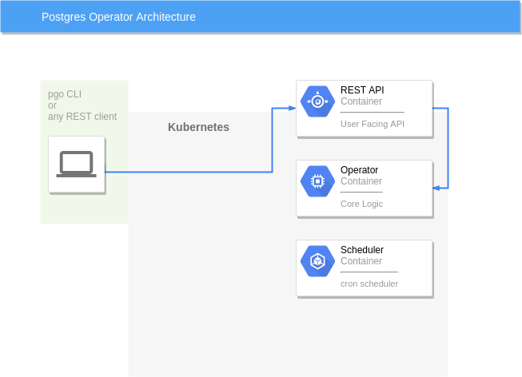

<h1 align="center">Crunchy Data PostgreSQL Operator</h1>

  

The *postgres-operator* is a controller that runs within a Kubernetes cluster that provides a means to deploy and manage PostgreSQL clusters.

Use the postgres-operator to:

 * deploy PostgreSQL containers including streaming replication clusters
 * scale up PostgreSQL clusters with extra replicas
 * add pgpool, pgbouncer, and metrics sidecars to PostgreSQL clusters
 * apply SQL policies to PostgreSQL clusters
 * assign metadata tags to PostgreSQL clusters
 * maintain PostgreSQL users and passwords
 * perform minor upgrades to PostgreSQL clusters
 * load simple CSV and JSON files into PostgreSQL clusters
 * perform database backups

## Deployment Requirements

The Operator deploys on Kubernetes and Openshift clusters.  Some form of storage is required, NFS, hostPath, and Storage Classes are currently supported.

The Operator includes various components that get deployed to your
Kubernetes cluster as shown in the following diagram and detailed
in the [Design](./docs/github/design.md).

The Operator is developed and tested on CentOS and RHEL linux platforms but is known to run on other Linux variants.

## Documentation
The following documentation is provided:

 - [pgo CLI Syntax and Examples](./docs/github/pgo-cli.md) 
 - [Installation](./docs/github/installation.md)
 - [Configuration](./docs/github/configuration.md) 
 - [pgo.yaml Description](./docs/github/pgo-yaml-configuration.md) 
 - [Security](./docs/github/security.md) 
 - [Design Overview](./docs/github/design.md) 
 - [Developing](./docs/github/developing.md) 
 - [Upgrading the Operator](./docs/github/upgrading.md)

