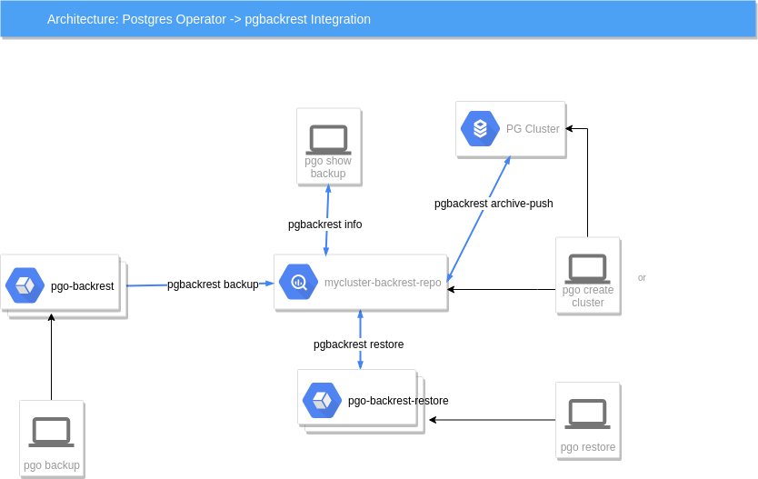

# Design 

## Provisioning

So, what does the Postgres Operator actually deploy
when you create a cluster?


On this diagram, objects with dashed lines are components
that are optionally deployed as part of a PostgreSQL Cluster
by the operator. Objects with solid lines are the fundamental and
required components.

For example, within the Primary Deployment, the *metrics* container
is completely optional. That component can be deployed using
either the operator configuration or command line arguments if you
want to cause metrics to be collected from the Postgres container.

Replica deployments are similar to the primary deployment but
are optional. A replica is not required to be created unless the
capability for one is necessary. As you scale up the Postgres
cluster, the standard set of components gets deployed and
replication to the primary is started.

Notice that each cluster deployment gets its own unique
Persistent Volumes. Each volume can use different storage
configurations which provides fined grained placement of 
the database data files.

## Custom Resource Definitions

Kubernetes Custom Resource Definitions are used in the design
of the PostgreSQL Operator to define the following:

 * Cluster - *pgclusters*
 * Backup - *pgbackups*
 * Upgrade - *pgupgrades*
 * Policy - *pgpolicies*
 * Tasks - *pgtasks*

Metadata about the Postgres cluster deployments are stored within
these CRD resources which act as the source of truth for the
Operator.

The *postgres-operator* design incorporates the following concepts:

## Event Listeners

Kubernetes events are created for the Operator's CRD resources when
new resources are made, deleted, or updated.  These events are
processed by the Operator to perform asyncronous actions.

As events are captured, controller logic is executed within the Operator
to perform the bulk of operator logic.

## REST API

A feature of the Operator is to provide a REST API upon which users
or custom applications can inspect and cause actions within the Operator
such as provisioning resources or viewing status of resources.

This API is secured by a RBAC (role based access control) security
model whereby each API call has a permission assigned to it.  API 
roles are defined to provide granular authorization to Operator
services.

## Command Line Interface

One of the unique features of the Operator is
the pgo command line interface (CLI).  This tool is used by a normal end-user
to create databases or clusters, or make changes to existing databases.

The CLI interacts with the REST API deployed within the *postgres-operator* deployment.


## Node Affinity

You can have the Operator add an affinity section to
a new Cluster Deployment if you want to cause Kubernetes to
attempt to schedule a primary cluster to a specific Kubernetes node.

You can see the nodes on your Kube cluster by running the following:
```
kubectl get nodes
```

You can then specify one of those names (e.g. kubeadm-node2)  when creating a cluster;
```
pgo create cluster thatcluster --node-name=kubeadm-node2
```

The affinity rule inserted in the Deployment will used a *preferred*
strategy so that if the node were down or not available, Kube would
go ahead and schedule the Pod on another node.

When you scale up a Cluster and add a replica, the scaling will
take into account the use of `--node-name`.  If it sees that a
cluster was created with a specific node name, then the replica
Deployment will add an affinity rule to attempt to schedule

## Fail-over

Manual and automated fail-over are supported in the Operator
within a single Kubernetes cluster.

Manual failover is performed by API actions involving a *query*
and then a *target* being specified to pick the fail-over replica
target.

Automatic fail-over is performed by the Operator by evaluating
the readiness of a primary.  Automated fail-over can be globally
specified for all clusters or specific clusters.

Users can configure the Operator to replace a failed primary with
a new replica if they want that behavior.

The fail-over logic includes:
 * deletion of the failed primary Deployment
 * pick the best replica to become the new primary
 * label change of the targeted Replica to match the primary Service
 * execute Postgres promote command on the targeted replica

## pgbackrest Integration

The Operator integrates various features of the pgbackrest (https://pgbackrest.org) backup and restore project.  A key component added to the Operator
is the *pgo-backrest-repo* container, this container acts as a pgbackrest
remote repository for the Postgres cluster to use for storing archive
files and backups.

The following diagrams depicts some of the integration features:



In this diagram, starting from left to right we see the following:

 * a user when they enter *pgo backup mycluster --backup-type=pgbackrest* will cause a pgo-backrest container to be run as a Job, that container will execute a   *pgbackrest backup* command in the pgbackrest repository container to perform the backup function.

 * a user when they enter *pgo show backup mycluster --backup-type=pgbackrest* will cause a *pgbackrest info* command to be executed on the pgbackrest repository container, the *info* output is sent directly back to the user to view

 * the Postgres container itself will use an archive command, *pgbackrest archive-push* to send archives to the pgbackrest repository container

 * the user entering *pgo create cluster mycluster --pgbackrest* will cause
a pgbackrest repository container deployment to be created, that repository
is exclusively used for this Postgres cluster

 * lastly, a user entering *pgo restore mycluster* will cause a *pgo-backrest-restore* container to be created as a Job, that container executes the *pgbackrest restore* command

