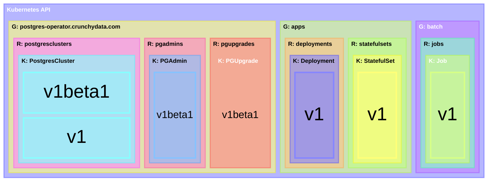

<!--
# Copyright 2025 - 2026 Crunchy Data Solutions, Inc.
#
# SPDX-License-Identifier: Apache-2.0
-->

# Custom Resource Definitions

These directories contain Go types that serve as [DTO]s for communicating with the [Kubernetes API].
We use [controller-gen] to produce [CRD]s based on these Go types with [schemas](validation.md) that match.

This [directory](.) contains our API Group, `postgres-operator.crunchydata.com`, and each subdirectory is a version:

- v1beta1 is compatible with Kubernetes 1.30, OpenShift 4.14, and later
- v1 uses newer CRD features and requires Kubernetes 1.30, OpenShift 4.17, and later

```
pkg/apis/postgres-operator.crunchydata.com
├── v1
└── v1beta1
```

[controller-gen]: https://book.kubebuilder.io/reference/controller-gen
[CRD]: https://docs.k8s.io/tasks/extend-kubernetes/custom-resources/custom-resource-definitions
[DTO]: https://martinfowler.com/eaaCatalog/dataTransferObject.html
[Kubernetes API]: https://docs.k8s.io/concepts/overview/kubernetes-api


# CRD Versions

Kubernetes organizes API resources into Groups. Each resource is represented by a Kind that can have multiple Versions. The shape of a CRD reflects this:

```yaml
kind: CustomResourceDefinition
metadata:
  name: "ideas.example.com" # {spec.plural}.{spec.group}
spec:
  group: "example.com" # one group (G)
  names:
    kind: Idea         # one kind (K)
    plural: ideas      # one resource (R)
    singular: idea     # one resource (R)
  versions:            # many versions (V)
    - name: v1beta1
      schema: …
    - name: v1
      schema: …
```

<!--

-->

Every Kubernetes API request includes the Group, Resource, Version, and Kind of its payload and expected response.
The version affects how Kubernetes handles the request, but it does *not* affect how Kubernetes stores the result.
Every Kubernetes [object] is stored according to its Group, Resource, Namespace, and Name.

> [!NOTE]
> - The API request URL contains the Group + Version + Resource (GVR).
> - The API request body includes the Group + Version (GV) as [`apiVersion`] and Kind (K) as `kind`.
> - [RBAC] matches on the Group + Resource (GR) of an API request.
> - The etcd key of each object contains the Group + Resource (GR), Namespace and Name.

This allows a variety of clients to concurrently use whichever API versions they understand.
Kubernetes converts what is stored to or from the version in the API request.
This means, however, that *every* version of a resource **must** be equivalent *every other* version.

Each CRD indicates which versions Kubernetes should accept from clients with `served=true`.
Kubernetes stores custom resource objects in the *single* version indicated with `storage=true`.

> [!IMPORTANT]
> We use the `None` conversion strategy and [validation ratcheting](validation.md#validation-ratcheting)...

[`apiVersion`]: https://docs.k8s.io/reference/using-api#api-groups
[object]: https://docs.k8s.io/concepts/overview/working-with-objects
[RBAC]: https://docs.k8s.io/reference/kubernetes-api/authorization-resources/role-v1

<!--
```mermaid
venn
  sets Group
  sets Kind
  sets Resource
  sets Version

  sets Group,Resource label: RBAC
  sets Group,Resource label: request url
  sets Group,Version  label: request body "apiVersion"
  sets Group,Version,Kind label: request body
  sets Group,Version,Kind label: response body
  sets Group,Version,Resource label: storage
```
-->
